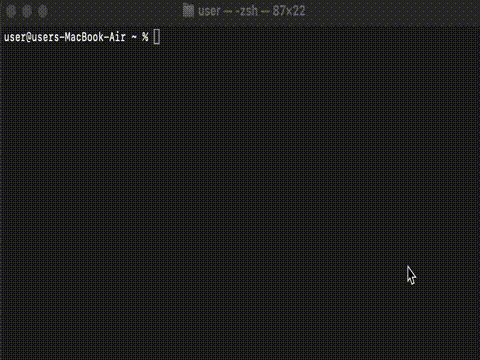

# clilo

CLI tool that queries local Ollama to generate Linux commands from natural language.



## Requirements

- Python 3.8+
- Local Ollama instance running on `localhost:11434`
- `gemma3:4b` model installed in Ollama

## Installation

```bash
./build.sh
./install.sh
```

## Usage

```bash
clilo "list files created from two days ago to 4 days ago"
# Output: find . -type f -mtime +2 -and -mtime -4

clilo "show disk usage of current directory"
# Output: du -sh .
```

## Build Requirements

- `requests`
- `pyinstaller`

Install with: `pip install -r requirements.txt`